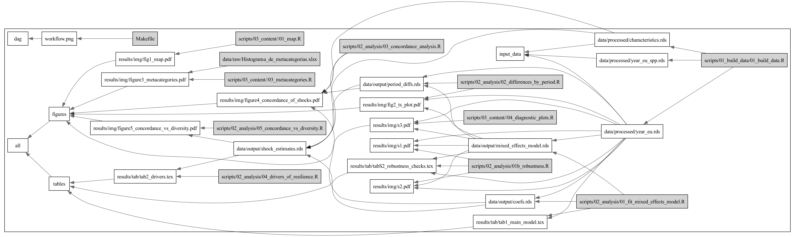

# Repository for: "_Climate-resilient fisheries are more resilient in general_"

By Villaseñor-Derbez et al.,

## Reproducibility

The repository contains all the data and code required to replicate our findings. It also includes [`renv`](https://rstudio.github.io/renv/articles/renv.html#getting-started) to
make sure you use the exact same package version we used. To reproduce our current environment,
use `renv::restore()`. This will use the metadata in our lockfile to install exactly the same version of every package.

The repository is equipped with a `makefile` outlining the relationship between scripts, inputs, and outputs. To rebuild our project, you can use the `make` command in your termial.



## Repository structure 

```
-- data
   |__output
      |__coefs.rds
      |__mixed_effects_model.rds
      |__period_diffs.rds
      |__shock_estimates.rds
   |__processed
      |__characteristics.rds
      |__cv_and_shocks.rds
      |__year_eu_spp.rds
      |__year_eu.rds
   |__raw
      |__Cooperativas- UnidadesEconomicas2020.xlsx
      |__cpi_t_rates.rds
      |__eu_names_and_types.csv
      |__Histograma_de_metacategorias.xlsx
      |__municipios_de_mexico
      |__permisos_pesca_comercial.xlsx
      |__Social Problems_AartJCV.xlsx
-- json_to_dot.py
-- make_p_to_json.py
-- makefile
-- README.md
-- renv
-- renv.lock
   |__activate.R
   |__library
      |__macos
   |__settings.json
-- resilient_ssf.Rproj
-- results
   |__img
      |__fig1_map.pdf
      |__fig1_map.png
      |__fig2_ts_plot.pdf
      |__fig2_ts_plot.png
      |__figure3_metacategories.pdf
      |__figure3_metacategories.png
      |__figure4_concordance_of_shocks.pdf
      |__figure4_concordance_of_shocks.png
      |__figure5_concordance_vs_diversity.pdf
      |__figure5_concordance_vs_diversity.png
      |__s1.pdf
      |__s1.png
      |__s2.pdf
      |__s2.png
      |__s3.pdf
      |__s3.png
   |__tab
      |__metacategories_table.tex
      |__tab1_main_model.tex
      |__tab2_drivers.tex
      |__tabS2_robustness_checks.tex
      |__taxa_table.tex
-- scripts
   |__00_set_up.R
   |__01_build_data
      |__01_build_data.R
   |__02_analysis
      |__01_fit_mixed_effects_model.R
      |__01b_robustness.R
      |__02_differences_by_period.R
      |__03_concordance_analysis.R
      |__04_drivers_of_resilience.R
      |__05_concordance_vs_diversity.R
   |__03_content
      |__01_map.R
      |__02_taxa_table.R
      |__03_metacategories.R
      |__04_diagnostic_plots.R
-- workflow.png
```

---------

## Output of `sessionInfo()` as of July 23, 2025

```
> sessionInfo()
R version 4.4.2 (2024-10-31)
Platform: aarch64-apple-darwin20
Running under: macOS Sequoia 15.5

Matrix products: default
BLAS:   /System/Library/Frameworks/Accelerate.framework/Versions/A/Frameworks/vecLib.framework/Versions/A/libBLAS.dylib 
LAPACK: /Library/Frameworks/R.framework/Versions/4.4-arm64/Resources/lib/libRlapack.dylib;  LAPACK version 3.12.0

locale:
[1] en_US.UTF-8/en_US.UTF-8/en_US.UTF-8/C/en_US.UTF-8/en_US.UTF-8

time zone: America/New_York
tzcode source: internal

attached base packages:
[1] stats     graphics  grDevices datasets  utils     methods   base     

loaded via a namespace (and not attached):
 [1] RColorBrewer_1.1-3 R6_2.6.1           tidyselect_1.2.1   farver_2.1.2       magrittr_2.0.3     gtable_0.3.6      
 [7] glue_1.8.0         tibble_3.3.0       pkgconfig_2.0.3    generics_0.1.4     dplyr_1.1.4        lifecycle_1.0.4   
[13] ggplot2_3.5.2      cli_3.6.5          scales_1.4.0       grid_4.4.2         vctrs_0.6.5        renv_1.1.4        
[19] compiler_4.4.2     rstudioapi_0.17.1  tools_4.4.2        pillar_1.11.0      rlang_1.1.6       
```
